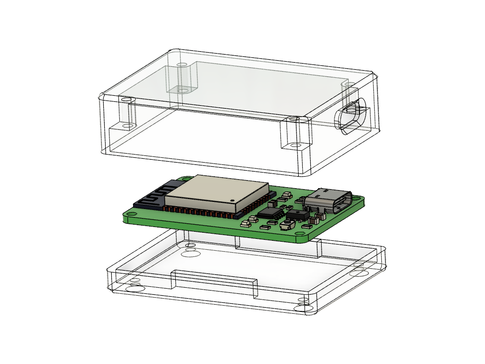
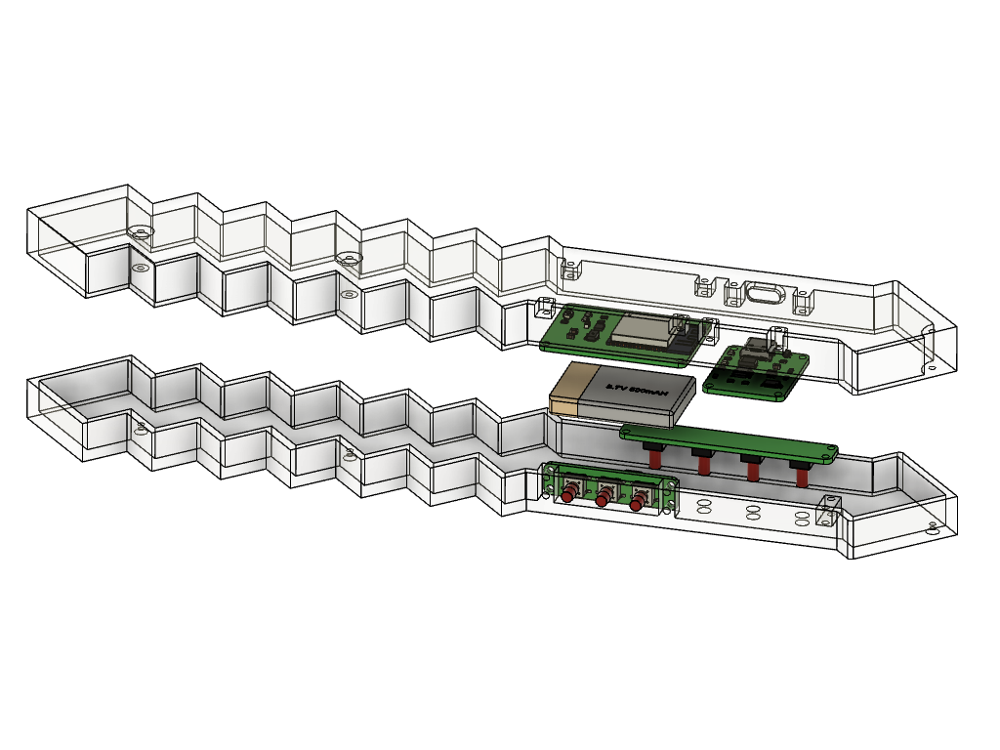

# NETHER
Virtual reality controller for playing minecraft

## Salient features
* Modular to support addons
* Tangle free gaming since the entire system is wireless
* Minimal lag during gaming due to high-speed data transfer
* Product certifications: CE certified and ROHS compliant 

## System block diagram

## HID module

### Functions 
- Act as a wireless gateway between the modules worn by the user and the computer.
- Communicate with the computer via USB as an HID device

### 3D render: Exploded view

## Stick module

### Functions
- Connect with the HID module wirelessly
- Send data associated with a button when a button is pressed
- Read IMU data, detect striking movement and send the data to the HID module
- Calibrate the IMU device when the calibration button is pressed

### 3D render: Exploded view

## Pedometer module

### Functions
- Connect with the HID module wirelessly
- Read accelerometer data, detect steps and send the data to the HID module
- Calibrate the IMU device when the calibration button is pressed

### 3D render: Exploded view

  
### Made with lots of ⏱️, 📚 and ☕ by InputBlackBoxOutput
